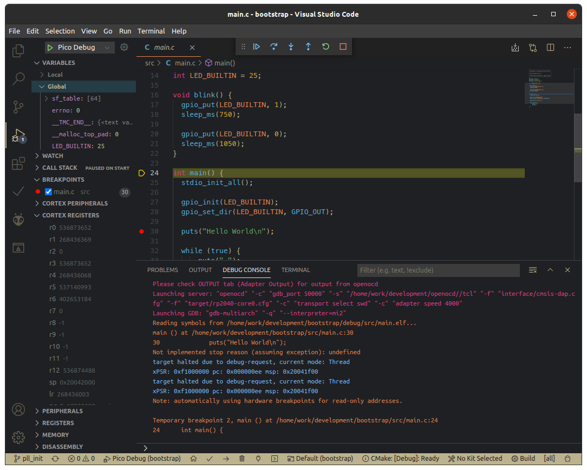

# RP2040 Pico Bootstrap

Kickstart your Raspberry Pico project!

Seamless integration with Visual Studio Code. Build & upload your program with only one click. Start an interactive debugging session for which you need only on Pico board.



## Prerequisites

To work with this repository, you need to have the following projects up and running:

- [Raspberry Pico SDK v1.20](https://github.com/raspberrypi/pico-sdk/releases)
- [WizIO Pico](https://github.com/Wiz-IO/wizio-pico/)

You also need to set the env var `PICO_SDK_PATH`.

## Setup for Compilation/Upload

For this to work, you need to set two environment variables:

- PICO_USB_DIR - directory path where your Raspberry Pico is mounted in USB storage/bootsel mode
- PICO_SERIAL_DIR - directory path where your Raspberry Pico is mounted in serial-over-USB mode

See the file `plattform.io` for more configuration options.

If all is done, you can compile and upload your Pico program with the default PlatformIO steps or by using the icons in your VS code bottom toolbar.

You can also compile the programm with a VS Code task, go to `Terminal -> Run Task -> Pico Build`.

Alternativly, in your shell:

```bash
cmake -B build -S . -D PICO_BUILD=ON
make -C build/src
```

## Setup for Debugging

You additionally need to have the following tools installed

- [Pico debug project](https://github.com/majbthrd/pico-debug) 
- [openocd](http://openocd.org/) 

See my [full installation manual](https://admantium.com/blog/pico02_setup_debugging/) for the complete explanation.

First, set the following environment variables:

- PICO_OPENOCD_PATH - directory where you downloaded and compiled OpenOCD

See `.vscode/launch.json` for more configuration options.

Second, grab the latest [pico debug UF2 file](https://github.com/majbthrd/pico-debug/releases/tag/v10.03) and upload it to your Raspberry Pico.

If you want to start debugging with VS Code, go to `Terminal -> Run Task -> Debug Build`, then  `Run -> Start Debugging`.

Alternativly, in your shell:

```bash
cmake -B build -S . -D DEBUG_BUILD=ON
make -C build/src
```

Then, upload the `build/src/main.elf` into GDB and connect to a running OpenOCD server.
